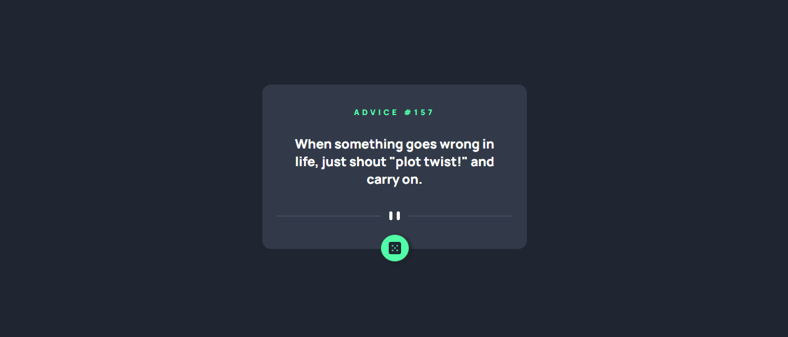

## Tecnologias usadas

 

### Preview

## Processo

O projeto foi criado com o uso de tags semânticas do HTML5 e o flexbox do CSS3 para dimensionamento eficiente dos elementos. O layout está responsivo para todos os tipos de tela. 

O app consiste basicamente em um gerar conselhos aleatórios quando o usuário clicar no botão. O layout foi desenvolvido utilizando HTML e CSS.

Os conselhos são gerados pela API [Advice Slip](https://api.adviceslip.com/) e a integração com o projeto foi realizada com JavaScript, manipulando os elementos do DOM.

## Próximos passos

Foi muito gratificante consumir minha primeira API sem sentir dificuldade no processo, além de ter sido uma oportunidade de praticar e testar o uso de funções assíncronas. Sinto-me confiante para subir o nível nos próximos projetos, onde pretendo usar React e ganhar novas habilidades de desenvolvimento!

### Deploy

<a href="https://als-samara.github.io/advice-generator-app/">Advice Generator App</a>