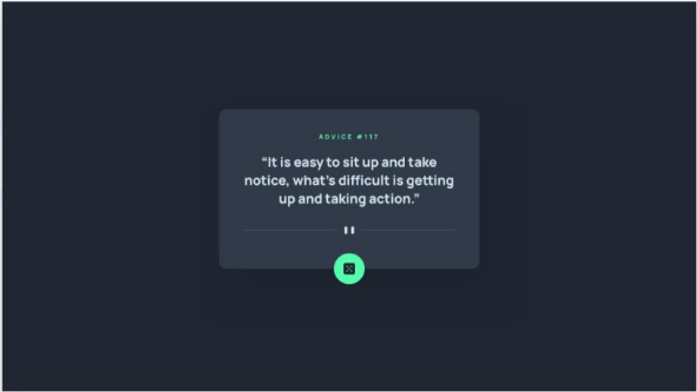
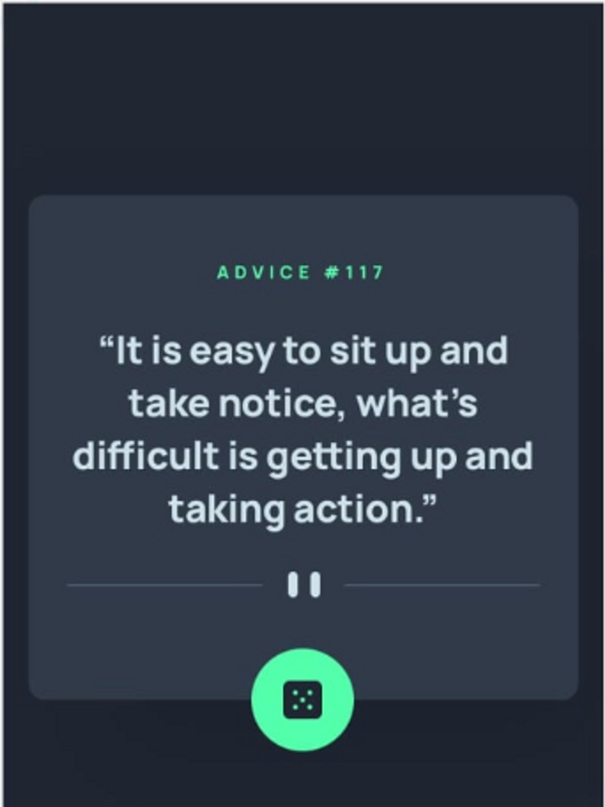

## Tecnologias usadas

### DESIGN

#### Desktop

#### Mobile design

### Link

- Live Site URL: <a href="https://als-samara.github.io/advice-generator-app/">Advice Generator App</a>

## Processo e próximos passos

O projeto foi criado com o uso de tags semânticas do HTML5 e o flexbox do CSS3 para dimensionamento eficiente dos elementos. O layout está responsivo para todos os tipos de tela. O app consiste basicamente em um gerar conselhos aleatórios toda vez que o usuário clicar no botão de atualizar. O layout foi deseenvolvido utilizando as tecnologias citadas acima. Para a funcionalidade de gerar os conselhos, o projeto será finalizado com o JavaScript.